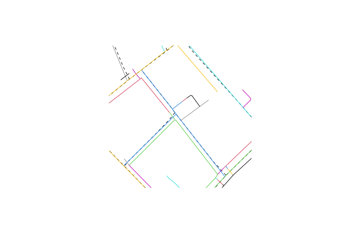

# ANIME: Approximate Network Integration, Matching, and Enrichment

ANIME is an algorithm that is used to identify partial matching and
attribute transfer between two sets of linestrings.

The core algorithm is implemented in `anime` Rust crate ([see Rust
docs](https://docs.rs/anime/)). The algorithm also comes with R bindings
(which are a work in progress as of this writing).

# Example:

``` r
library(sf)
```

    Linking to GEOS 3.11.0, GDAL 3.5.3, PROJ 9.1.0; sf_use_s2() is TRUE

``` r
library(dplyr)
```


    Attaching package: 'dplyr'

    The following objects are masked from 'package:stats':

        filter, lag

    The following objects are masked from 'package:base':

        intersect, setdiff, setequal, union

``` r
library(tigris)
```

    To enable caching of data, set `options(tigris_use_cache = TRUE)`
    in your R script or .Rprofile.

``` r
library(anime)
library(ggplot2)

# get sample lines from package
targets_fp <- system.file("extdata", "maine-osm-targets.fgb", package = "anime")
sources_fp <- system.file("extdata", "maine-tigris-sources.fgb", package = "anime")

# read into sf objects
targets <- read_sf(targets_fp)
sources <- read_sf(sources_fp)

# perfomr matches
matches <- anime(
  sources,
  targets,
  distance_tolerance = 10,
  angle_tolerance = 5
)

matches
```

    <anime>
    sources: 8
    targets: 32
    angle tolerance: 5.0
    distance tolerance: 10.0

``` r
# view original geometries
plot(st_geometry(sources), lty = 2)
plot(st_geometry(targets), col = 1:nrow(targets), add = TRUE)
```



``` r
# extract matches as a data.frame
match_tbl <- get_matches(matches)
match_tbl
```

    # A data frame: 23 × 5
       target_id source_id shared_len source_weighted target_weighted
     *     <int>     <int>      <dbl>           <dbl>           <dbl>
     1         1         1       73.5           1.00            1.25 
     2         2         1       50.0           0.680           0.933
     3         3         1       73.5           1.00            0.991
     4         4         2        0             0               0    
     5         6         1        0             0               0    
     6         7         2        0             0               0    
     7         8         2        0             0               0    
     8        11         1       18.7           0.255           0.752
     9        12         2      170.            0.895           0.894
    10        13         3      132.            0.983           0.993
    # ℹ 13 more rows

``` r
# find most matched source
most_matched_source <- count(match_tbl, source_id, sort = TRUE) |>
  slice(1) |>
  pull(source_id)

# find the matched targets in the sf object
matched_tars <- match_tbl |>
  filter(source_id == most_matched_source, shared_len > 0) |>
  inner_join(transmute(targets, target_id = row_number())) |>
  st_as_sf()
```

    Joining with `by = join_by(target_id)`

``` r
# visualize them
ggplot() +
  geom_sf(aes(color = shared_len), matched_tars, lwd = 2) +
  geom_sf(data = sources[most_matched_source, ], lty = 2) +
  scale_color_binned() +
  theme_void()
```


