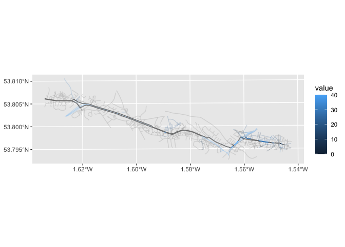

<!-- README.md is generated from README.Rmd. Please edit that file -->

# anime

<!-- badges: start -->
<!-- badges: end -->

The goal of anime is to join the attributes of two spatial datasets
based on the amount of overlap between their linestrings.

## Installation

You can install the development version of anime from
[GitHub](https://github.com/) with:

``` r
# install.packages("pak")
pak::pak("JosiahParry/anime/r")
```

``` r
library(anime)
```

## Basic example

`anime` uses the concept of a `target` and `source` linestrings.

`target` linestrings are matched *to* the the `source` linestrings. The
amount of overlap between the `target` and `source` linestrings can be
used to *interpolate attributes* from the `source` *onto* the `target`
geometries.

> [!IMPORTANT]
>
> Geometries *must* be planar—that is in a projected CRS.

``` r
target_fp <- "https://github.com/JosiahParry/anime/raw/refs/heads/main/r/data-raw/geojson/x_negative.geojson"
source_fp <- "https://github.com/JosiahParry/anime/raw/refs/heads/main/r/data-raw/geojson/y_negative.geojson"

# This is the source data
sources <- sf::read_sf(source_fp) 

# This is the target data, the attributes in the source data will 
# be added to the geometries of the target
target <- sf::read_sf(target_fp) 

plot(sf::st_geometry(sources), col = sources$value)
plot(sf::st_geometry(target), add = TRUE)
```


The lines are parallel but are not identical. The objective of `anime`
is to find these partial matches.

``` r
matches <- anime::anime(
  sources,
  target,
  distance_tolerance = 0.5,
  angle_tolerance = 5
)

matches_tbl <- get_matches(matches)
matches_tbl
#> # A data frame: 4 × 5
#>   target_id source_id shared_len source_weighted target_weighted
#> *     <int>     <int>      <dbl>           <dbl>           <dbl>
#> 1         1         1       1.58             0.5           0.767
#> 2         2         3       1.12             0.5           0.528
#> 3         2         2       1                0.5           0.472
#> 4         3         3       1.12             0.5           0.959
```

We can use this information to join the attributes of the source data to
the target data. In this example we take values from `sources` and use
`reframe()` to create a new data.frame of interpolated values.

> [!NOTE]
>
> `interpolate_intensive()` and `interpolate_extensive()` require
> numeric variables from the `source` and return a numeric vector with
> the same lengths as `target`.

``` r
library(dplyr)
#> 
#> Attaching package: 'dplyr'
#> The following objects are masked from 'package:stats':
#> 
#>     filter, lag
#> The following objects are masked from 'package:base':
#> 
#>     intersect, setdiff, setequal, union

# interpolate values
interpolated_from_source <- sources |> 
  reframe(value = interpolate_intensive(value, matches))

# bind them together
interpolated_target <- bind_cols(target, interpolated_from_source)
```

The result can be plotted as follows:

``` r
plot(interpolated_target["value"])
```


## Example with real data

Imagine the following use case: we want to know how fast traffic moves
on roads alongside the Leeds-Bradford cycle superhighway. Notice that
the objects are transformed to `EPSG:27700` so that they are in a
projected CRS\>

``` r
target_fp <- "https://github.com/nptscot/match_linestrings/releases/download/v0.1/leeds_bradford_cycle_superhighway_linestrings.geojson"
source_fp <- "https://github.com/nptscot/match_linestrings/releases/download/v0.1/leeds_transport_network_near_superhighway.geojson"

target <- sf::read_sf(target_fp) |>
  sf::st_transform(27700)

sources <- sf::read_sf(source_fp) |>
  sf::st_transform(27700) |>
  transmute(value = as.numeric(gsub(" mph", "", maxspeed))) 

plot(sf::st_geometry(target))
plot(sources, add = TRUE)
```


At present, interpolation cannot handle missing values. We must find
matches without the features with missing values.

``` r
# filter out missing values before matching
sources_no_na <- filter(sources, !is.na(value))

# find matches
matches <- anime::anime(
  sources_no_na,
  target,
  # 50 meters distance tolerance 
  distance_tolerance = 50,
  # 10° tolerance 
  angle_tolerance = 10
)

target_interpolated <- target |> 
  mutate(value = interpolate_intensive(sources_no_na$value, matches))

summary(sources$value)
#>    Min. 1st Qu.  Median    Mean 3rd Qu.    Max.    NA's 
#>    5.00   20.00   30.00   28.16   40.00   40.00     925
summary(target_interpolated$value)
#>    Min. 1st Qu.  Median    Mean 3rd Qu.    Max.    NA's 
#>    0.00   24.51   30.00   28.07   39.77   40.00      68
```

``` r
library(ggplot2)

 ggplot() +
  geom_sf(aes(color = value), data = sources, alpha = 0.2) +
  geom_sf(aes(color = value), data = sf::st_crop(target_interpolated, sf::st_bbox(sources)))
#> Warning: attribute variables are assumed to be spatially constant throughout
#> all geometries
```


