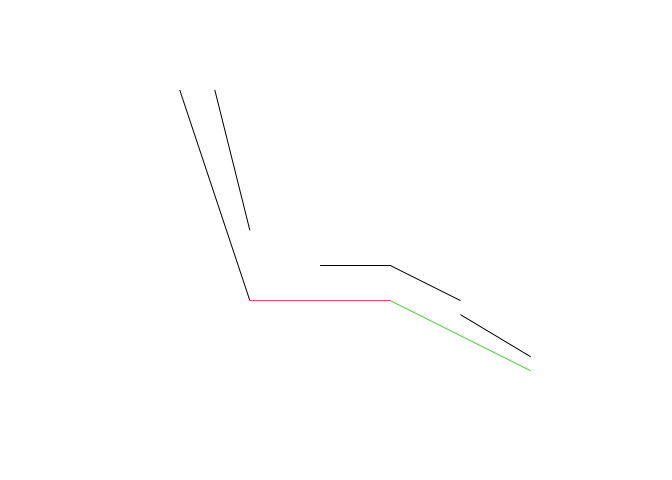
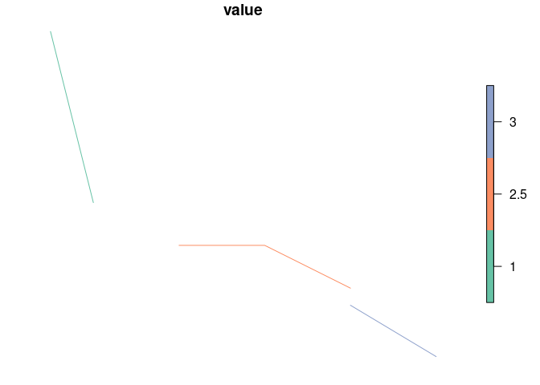
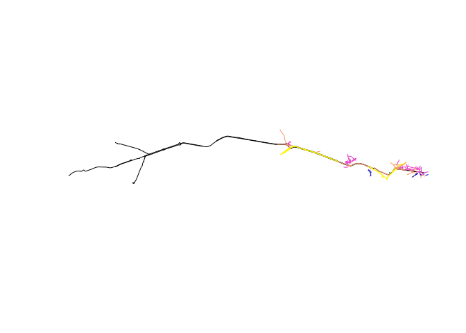

<!-- README.md is generated from README.Rmd. Please edit that file -->

# anime

<!-- badges: start -->
<!-- badges: end -->

The goal of anime is to join the attributes of two spatial datasets
based on the level of overlap between their linestrings.

## Installation

You can install the development version of anime from
[GitHub](https://github.com/) with:

``` r
# install.packages("pak")
pak::pak("JosiahParry/anime/r")
```

``` r
library(anime)
library(dplyr)
#> 
#> Attaching package: 'dplyr'
#> The following objects are masked from 'package:stats':
#> 
#>     filter, lag
#> The following objects are masked from 'package:base':
#> 
#>     intersect, setdiff, setequal, union
```

## Basic example

This is a basic example, with the target data `x` and the source data
`y`. The attributes in the `y` data will be added to the geometries of
`x`.

``` r
# This is the target data, the attributes in the y data will be added to the geometries of x
x <- sf::read_sf("https://github.com/JosiahParry/anime/raw/refs/heads/main/r/data-raw/geojson/x_negative.geojson")
# This is the source data
y <- sf::read_sf("https://github.com/JosiahParry/anime/raw/refs/heads/main/r/data-raw/geojson/y_negative.geojson")
names(y)
#> [1] "value"    "geometry"
names(x)
#> [1] "id"       "geometry"
x
#> Simple feature collection with 3 features and 1 field
#> Geometry type: LINESTRING
#> Dimension:     XY
#> Bounding box:  xmin: 0.5 ymin: -0.8 xmax: 5 ymax: 3
#> Geodetic CRS:  WGS 84
#> # A tibble: 3 × 2
#>      id            geometry
#>   <int>    <LINESTRING [°]>
#> 1     1        (0.5 3, 1 1)
#> 2     2 (2 0.5, 3 0.5, 4 0)
#> 3     3    (4 -0.2, 5 -0.8)
y
#> Simple feature collection with 3 features and 1 field
#> Geometry type: LINESTRING
#> Dimension:     XY
#> Bounding box:  xmin: 0 ymin: -1 xmax: 5 ymax: 3
#> Geodetic CRS:  WGS 84
#> # A tibble: 3 × 2
#>   value         geometry
#>   <int> <LINESTRING [°]>
#> 1     1       (0 3, 1 0)
#> 2     2       (1 0, 3 0)
#> 3     3      (3 0, 5 -1)
y |>
  mutate(value = as.character(value)) |>
  plot()
plot(sf::st_geometry(x), add = TRUE)
```



The package returns the matches between the target and source data:

``` r
res <- anime::anime(
  x,
  y,
  distance_tolerance = 1,
  angle_tolerance = 20
)
res_df <- as.data.frame(res)
res_df
#>   target_id source_id shared_len source_weighted target_weighted
#> 1         0         0   2.061553        1.000000       0.6519202
#> 2         1         1   1.000000        0.472136       0.5000000
#> 3         2         2   1.166190        1.000000       0.5215362
#> 4         2         1   1.118034        0.527864       0.5000000
```

We can use this information to join the attributes of the source data to
the target data:

``` r
library(dplyr)
y_matched <- left_join(
  y |>
    mutate(target_id = row_number() - 1) |>
    sf::st_drop_geometry(),
  res_df
)
#> Joining with `by = join_by(target_id)`
y_aggregated <- y_matched |>
  group_by(id = source_id + 1) |>
  summarise(
    value = weighted.mean(value, target_weighted, na.rm = TRUE)
  )
x_joined <- left_join(
  x,
  y_aggregated
)
#> Joining with `by = join_by(id)`
```

The result can be plotted as follows:

``` r
x_joined |>
  transmute(value = as.character(round(value, 1))) |>
  plot()
```



## Example with real data

Imagine the following use case: we want to know how fast traffic moves
on roads alongside the Leeds-Bradford cycle superhighway.

``` r
target <- sf::read_sf("https://github.com/nptscot/match_linestrings/releases/download/v0.1/leeds_bradford_cycle_superhighway_linestrings.geojson") |>
  sf::st_transform(27700)
source <- sf::read_sf("https://github.com/nptscot/match_linestrings/releases/download/v0.1/leeds_transport_network_near_superhighway.geojson") |>
  sf::st_transform(27700) |>
  transmute(value = as.numeric(gsub(" mph", "", maxspeed))) 
plot(sf::st_geometry(target))
plot(source, add = TRUE)
```



## Comparison with `stplanr::rnet_join`

A similar result can be obtained using the `stplanr::rnet_join`
function. As shown in the results and benchmark below, the `anime`
implementation is much faster than the `stplanr` implementation and
produces a better result.

``` r
sf::st_crs(x) <- 27700
sf::st_crs(y) <- 27700
x_joined <- stplanr::rnet_join(
  x,
  y,
  dist = 1,
  max_angle_diff = 30,
  segment_length = 0.1
)
# x_joined
# plot(x_joined["value"])
# mapview::mapview(x_joined["value"]) +
#   mapview::mapview(x) +
#   mapview::mapview(y)
```

``` r
x_aggregated <- x_joined |>
  sf::st_drop_geometry() |>
  group_by(id) |>
  summarise(
    value = weighted.mean(value, length_y)
  )
x_joined <- left_join(
  x,
  x_aggregated
)
x_joined |>
  transmute(value = as.character(round(value, 1))) |>
  plot()
x_joined$value
#> [1] 1 3 3
```

## Benchmark

``` r
stplanr_implementation <- function() {
  x_joined <- stplanr::rnet_join(
    x,
    y,
    dist = 1,
    max_angle_diff = 30,
    segment_length = 0.1
  )
}
anime_implmentation <- function() {
  res <- anime::anime(
    x,
    y,
    distance_tolerance = 1,
    angle_tolerance = 20
  )
}
bench::mark(
  stplanr_implementation(),
  anime_implmentation(),
  check = FALSE
) |>
  select(expression, `itr/sec`, mem_alloc)
#> # A tibble: 2 × 3
#>   expression               `itr/sec` mem_alloc
#>   <bch:expr>                   <dbl> <bch:byt>
#> 1 stplanr_implementation()      9.98   130.6KB
#> 2 anime_implmentation()        52.5     30.5KB
```
